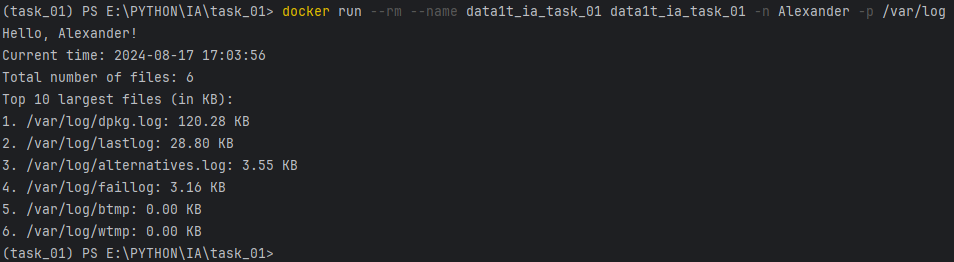

# Итоговая аттестация Задание 1.


## Создание Docker-контейнера с простым Python-приложением

## Цель:
Научиться создавать Docker-контейнер, который запускает Python-скрипт для анализа файловой системы и вывода приветствия.

## Описание задания:

- Создайте директорию для вашего проекта, например docker_python_app, и в ней создайте файл app.py.
- В файле app.py создайте скрипт, который будет выполнять следующие задачи:
  - Вычислять количество файлов в заданном пути (по умолчанию — корневой каталог файловой системы). Задание пути производится следующим образом: в начале скрипта может определяться переменная path, содержащая путь; если же переменная не определена (закомментирована), то используется вышеупомянутое значение по умолчанию.
  - Выводить топ-10 файлов по размеру (в Кб).
  - Принимать аргумент из командной строки для вывода приветствия с указанным именем, а также текущей даты и времени.
- Теперь создайте Dockerfile в той же директории. Этот файл будет использоваться для сборки Docker-образа.
- Теперь, когда у вас есть Dockerfile и app.py, можно собрать Docker-образ.
- После того как Docker-образ собран, можно запустить контейнер с вашим приложением. 

## Запуск
### Установка и запуск образа
```docker run --rm --name data1t_ia_task_01 alneoru/data1t_ia:task_01 -n Alexander -p /var/log```
### Параметры запуска:
- ```параметр -n или --name``` Указание имени
- ```параметр -p или --path``` Указание пути

После запуска контейнера вы должны увидеть вывод в терминале, который будет включать:

- Приветственное сообщение с указанным именем и текущим временем.
- Общее количество файлов в указанном пути.
- Топ-10 файлов по размеру в указанном пути.

## Пример вывода:
```
Hello, Alice!
Current time: 2024-08-13 12:34:56
Total number of files: 1520
Top 10 largest files (in KB):
/path/to/file1: 1024.50 KB
/path/to/file2: 820.30 KB
```

## Результат задания
После выполнения задания у вас будет Docker-контейнер, который при запуске:
- Выводит приветственное сообщение с именем пользователя и текущим временем.
- Вычисляет количество файлов в указанной директории.
- Выводит топ-10 файлов по размеру.

## Пример запуска
